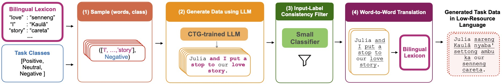

# LexC-Gen: Lexicon-Conditioned Data Generation for Extremely Low-Resource Languages

LexC-Gen generates sentiment analysis and topic classification data for extremely low-resource languages using open-access models and bilingual lexicons. The key idea is to prompt LLMs to generate English (or any high-resource-language) task data using words from bilingual lexicons so the generated dataset can be better word-translated into low-resource languages.

📄 Paper: TODO

🗂️ Data Artifacts: https://github.com/BatsResearch/LexC-Gen-Data-Archive

💻 This repository provides code for LexC-Gen used for generating sentiment analysis and topic classification data using Gatitos bilingual lexicons and reproducing our paper. But our code are written in a modular manner so it can be easily adapted to other tasks or bilingual lexicons.

🧩 We provide our main results for NusaX and SIB-200 in `paper_results/` with average accuracy and standard deviations (over 5 runs) reported, which can serve as a form of sanity check for other researchers reproducing our work.

---

## Table of Contents

- [Setup](#setup)
- [Download Task Datasets and Bilingual Lexicons](#download-task-datasets-and-bilingual-lexicons)
	- [Task Datasets](#task-datasets)
	- [Bilingual Lexicons](#bilingual-lexicons)
- [LexC-Gen Code](#lexc-gen-code)
	- [1. CTG-Training](#1-ctg-training)
	- [2. Lexicon-Conditioned Task Data Generation](#2-lexicon-conditioned-task-data-generation)
	- [3. Input-Label Filtering and Word-to-Word Translation](#3-input-label-filtering-and-word-to-word-translation)
- [Evaluation](#evaluation)
	- [Generate Validation Dataset for Task Finetuning](#generate-validation-dataset-for-task-finetuning)
	- [Evaluate on Local LexC-Gen Data](#evaluate-on-local-lexc-gen-data)
	- [Evaluate on HF LexC-Gen Data](#evaluate-on-hf-lexc-gen-data)
- [Baselines](#baselines)
	- [Cross-Lingual Zero-Shot](#cross-lingual-zero-shot)
	- [Word Translation](#word-translation)
	- [Notes](#notes)


---
## Setup

```bash
git clone https://github.com/BatsResearch/LexC-Gen.git
cd LexC-Gen
pip3 install -r requirements.txt
mkdir outputs # create outputs directory in LexC-Gen folder for storing all generated data artifacts
```

## Download Task Datasets and Bilingual Lexicons
### Task Datasets
We experiment with [NusaX (Winata et al., 2023)](https://aclanthology.org/2023.eacl-main.57/) and [SIB-200 (Adelani et al., 2023)](https://aclanthology.org/2023.eacl-main.57/) datasets. These datasets are also available on HuggingFace but our work uses their raw csv/tsv files hosted on GitHub.

```bash
# nusax
DATA=... # your designated datasets folder
cd $DATA
git clone https://github.com/IndoNLP/nusax.git

# sib200
DATA=... # your designated datasets folder
cd $DATA
git clone https://github.com/dadelani/sib-200.git # follow their README instructions to create SIB dataset.
```

### Bilingual Lexicons
We use [GATITOS bilingual lexicons (Jones et al., 2023)](https://aclanthology.org/2023.emnlp-main.26/) for our work, which maps English words to many extremely low-resource languages.

```bash
cd $LEX # your designated bilingual lexicon folder
git clone https://github.com/google-research/url-nlp.git
```

---

## LexC-Gen Code

In step (1) and (2), we first train [BLOOMZ-7.1B (Muennighoff et al., 2023)](https://aclanthology.org/2023.acl-long.891/) for controlled-text generation (CTG) and then use it to generate English datasets conditioned on bilingual lexicons. After that, in step (3) and (4), we perform input-label consistency label filtering and word-to-word translation to translate the generated data into low-resource languages.

### 1. CTG-Training 
#### Prepare CTG-Training Dataset
We first prepare the CTG-training dataset from the existing task data.

```bash
# nusax
EXIST_DATA="${DATA}/nusax/datasets/sentiment/english/train.csv"
OUTPUT_FILE="./outputs/ctg_data/nusax_en.txt"
TASK="nusax"
python3 ./scripts/ctg_dataset.py \
	--existing_task_data $EXIST_DATA \
	--output_file $OUTPUT_FILE \
	--task_data $TASK

# sib200
EXIST_DATA="${DATA}/sib-200/data/eng/train.tsv"
OUTPUT_FILE="./outputs/ctg_data/sib200_en.txt"
TASK="sib200"
python3 ./scripts/ctg_dataset.py \
	--existing_task_data $EXIST_DATA \
	--output_file $OUTPUT_FILE \
	--task_data $TASK
```

#### CTG-Training with QLoRA
Now, we perform CTG-training for the BLOOMZ-7b1 model using [QLoRA (Dettmers et al., 2023)](https://arxiv.org/abs/2305.14314), which allows us to finetune the model on a single V100 or RTX3090 GPU. We already set the best hyperparameters.

```bash
# nusax
python3 ./scripts/ctg_train.py \
	--ctg_dataset ./outputs/ctg_data/nusax_en.txt \
	--output_dir ./outputs/bloomz-7b1-nusax-en-ctg/ \
	--logging_steps 500 \
	--eval_steps 500 \
	--save_steps 500 \
	--num_train_epochs 10

# sib200
python3 ./scripts/ctg_train.py \
	--ctg_dataset ./outputs/ctg_data/sib200_en.txt \
	--output_dir ./outputs/bloomz-7b1-sib200-en-ctg/ \
	--logging_steps 500 \
	--eval_steps 500 \
	--save_steps 500 \
	--num_train_epochs 10
```

#### Selecting Best CTG-trained Checkpoint
We select the best QLoRA adapter checkpoint based on its ability to use provided words to form sentences. We found that different languages in Gatitos can have different entries. Therefore, the best checkpoint can be different for different low-resource languages in generating task data. 

We recommend selecting the best checkpoint for the language you want to create tasks for, although the best checkpoint for a language usually applies to other languages. 

The code below evaluates a particular checkpoint on how many words it used (as is) on average from the provided list of 10 words to form sentences.

```bash
# nusax
CKPT=... # path to a particular lora checkpoint
TGT_LANG="ace" # ace, ban, bbc, bjn, bug, mad, min
python3 ./scripts/ctg_eval_ckpt.py \
	--peft_model_id $CKPT \
	--lexicons_dir "${LEX}/url-nlp/gatitos" \
	--task_data "nusax" \
	--tgt_lang $TGT_LANG \
	--total 200 \
	--top_p 0.1 \
	--temperature 1.0 \
	--do_print_output

# sib200
CKPT=... # path to a particular lora checkpoint
TGT_LANG="gn" # tum, ee, ln, fj, ts, bm, sg, ak, lus, gn
python3 ./scripts/ctg_eval_ckpt.py \
	--peft_model_id $CKPT \
	--lexicons_dir "${LEX}/url-nlp/gatitos" \
	--task_data "sib200" \
	--tgt_lang $TGT_LANG \
	--total 200 \
	--top_p 0.1 \
	--temperature 1.0 \
	--do_print_output
```

We have provided the scripts `scripts/ctg_eval_ckpt_nusax.sh` and `scripts/ctg_eval_ckpt_sib200.sh` to print out the average lexicon usage for every CTG-training checkpoint. You just have to select the checkpoint with the largest usage. We already set the best hyperparameters.

**Sanity Check**: A good checkpoint for NusaX would use >5.5 provided tokens (out of 10) on average, and for SIB-200 it would be >1.5 tokens on average.

### 2. Lexicon-Conditioned Task Data Generation
We can now generate English data using the CTG-trained checkpoint and the bilingual lexicon. We already set the best hyperparameters in the default arguments.

```bash
# nusax
TGT_LANG="ace" # ace, ban, bbc, bjn, bug, mad, min
TOTAL=100000 # number of sentences to be generated
CKPT=... # best checkpoint found
WRITE_FOLDER="./outputs/lexcgen-nusax"
WRITE_FILE="./outputs/bloomz-7b1-nusax-en-${TGT_LANG}-total${TOTAL}.txt"
python3 ./scripts/lexcgen_ctg.py \
	--write_file $WRITE_FILE \
	--peft_model_id $CKPT \
	--tgt_lang $TGT_LANG \
	--total $TOTAL \
	--task_data nusax \
	--lexicons_dir "${LEX}/url-nlp/gatitos"

# sib200
TGT_LANG="gn" # tum, ee, ln, fj, ts, bm, sg, ak, lus, gn
TOTAL=100000 # number of sentences to be generated
CKPT=... # best checkpoint found
WRITE_FOLDER="./outputs/lexcgen-sib200"
WRITE_FILE="./outputs/bloomz-7b1-sib200-en-${TGT_LANG}-total${TOTAL}.txt"
python3 ./scripts/lexcgen_ctg.py \
	--write_file $WRITE_FILE \
	--peft_model_id $CKPT \
	--tgt_lang $TGT_LANG \
	--total $TOTAL \
	--task_data nusax \
	--lexicons_dir "${LEX}/url-nlp/gatitos"
```

### 3. Input-Label Filtering and Word-to-Word Translation
Our codes here will generate the following artifacts:
- the English generated dataset (originally in `txt` format) in csv/tsv format. 
- filtered English generated dataset (file starts with `filtered-*`).
- translated generated task dataset (file starts with `translated_filtered-*`)

**🎯 The translated generated task dataset is the synthetic data that we use to finetune task classifiers with.**

```bash
TGT_LANG="ace" # ace, ban, bbc, bjn, bug, mad, min
TOTAL=100000 
READ_FILE="./outputs/lexcgen-nusax/bloomz-7b1-nusax-en-${TGT_LANG}-total${TOTAL}.txt"  # raw generated file from CTG-trained LLMs
OUTPUT_DIR="./outputs/final-nusax/"
python3 ./scripts/lexcgen_filter.py \
	--target_lang $TGT_LANG \
	--file $READ_FILE \
	--task_data "nusax" \
	--output_dir $OUTPUT_DIR \
	--filter_train_file "${DATA}/nusax/datasets/sentiment/english/train.csv" \
	--filter_valid_file "${DATA}/nusax/datasets/sentiment/english/valid.csv"

python3 ./scripts/lexcgen_translate.py \
	--target_lang $TGT_LANG \
	--file "./outputs/final-nusax/filtered-bloomz-7b1-nusax-en-${TGT_LANG}-total${TOTAL}.csv" \
	--lexicons_dir "${LEX}/url-nlp/gatitos" \
	--output_dir "./outputs/final-nusax/"

# sib200
TGT_LANG="gn" # tum, ee, ln, fj, ts, bm, sg, ak, lus, gn
TOTAL=100000 # number of sentences to be generated
READ_FILE="./outputs/lexcgen-sib200/bloomz-7b1-sib200-en-${TGT_LANG}-total${TOTAL}.txt"  # raw generated file from CTG-trained LLMs
OUTPUT_DIR="./outputs/final-sib200/"
python3 ./scripts/lexcgen_filter.py \
	--target_lang $TGT_LANG \
	--file $READ_FILE \
	--task_data "sib200" \
	--output_dir $OUTPUT_DIR \
	--filter_train_file "${DATA}/sib-200/data/eng/train.tsv" \
	--filter_valid_file "${DATA}/sib-200/data/eng/dev.tsv"

python3 ./scripts/lexcgen_translate.py \
	--target_lang $TGT_LANG \
	--file "./outputs/final-sib200/filtered-bloomz-7b1-sib200-en-${TGT_LANG}-total${TOTAL}.tsv" \
	--lexicons_dir "${LEX}/url-nlp/gatitos" \
	--output_dir "./outputs/final-sib200/"
```

---

## Evaluation

### Generate Validation Dataset for Task Finetuning
Our synthetic data generated above are solely for training.

For validation data, we perform word translation on the existing task validation data.
```bash
# nusax
TGT_LANG="ace" # ace, ban, bbc, bjn, bug, mad, min
python3 ./scripts/lexcgen_translate.py \
	--target_lang $TGT_LANG \
	--file "${DATA}/nusax/datasets/sentiment/english/valid.csv" \
	--lexicons_dir "${LEX}/url-nlp/gatitos" \
	--output_dir "./outputs/final-nusax-valid/${TGT_LANG}"

# sib200
TGT_LANG="gn" # tum, ee, ln, fj, ts, bm, sg, ak, lus, gn
python3 ./scripts/lexcgen_translate.py \
	--target_lang $TGT_LANG \
	--file "${DATA}/sib-200/data/eng/dev.tsv" \
	--lexicons_dir "${LEX}/url-nlp/gatitos" \
	--output_dir "./outputs/final-sib200-valid/${TGT_LANG}"
```

### Evaluate on Local LexC-Gen Data
Now we perform task finetuning of mBERT classifier on the LexC-Gen generated data and evaluate on the test dataset.

```bash
# nusax
TGT_LANG="ace" # ace, ban, bbc, bjn, bug, mad, min
NUSAX_TGT_LANG_FULL="acehnese"
TOTAL=100000
python3 ./scripts_eval/nusax_task_local_data.py \
	--target_lang $TGT_LANG \
	--train_csv_path "./outputs/final-nusax/translated_filtered-bloomz-7b1-nusax-en-${TGT_LANG}-total${TOTAL}.csv" \
	--valid_csv_path "./outputs/final-nusax-valid/${TGT_LANG}/translated_valid.csv" \
	--test_csv_path "${DATA}/nusax/datasets/sentiment/${NUSAX_TGT_LANG_FULL}/test.csv"

# sib200
TGT_LANG="gn" # tum, ee, ln, fj, ts, bm, sg, ak, lus, gn
SIB_TGT_LANG_FULL="grn_Latn"
TOTAL=100000
python3 ./scripts_eval/sib200_task_local_data.py \
	--target_lang $TGT_LANG \
	--train_csv_path "./outputs/final-sib200/translated_filtered-bloomz-7b1-sib200-en-${TGT_LANG}-total${TOTAL}.tsv" \
	--valid_csv_path "./outputs/final-sib200-valid/${TGT_LANG}/translated_dev.tsv" \
	--test_csv_path "${DATA}/sib-200/data/annotated/${SIB_TGT_LANG_FULL}/test.tsv"
```

### Evaluate on HF LexC-Gen Data

We also upload our LexC-Gen generated data to HuggingFace (HF) for reproducibility purpose. They are stored at:
- 🤗 [BatsResearch/NusaX-senti-LexC-Gen](https://huggingface.co/datasets/BatsResearch/NusaX-senti-LexC-Gen)
- 🤗 [BatsResearch/sib200-LexC-Gen](https://huggingface.co/datasets/BatsResearch/sib200-LexC-Gen)

Because the columns of the HF datasets have to be renamed and the label names need to be changed into integer, we provide different scripts for evaluation.

```bash
# nusax
TGT_LANG="ace"
SIZE="100k"
CONFIG="${TGT_LANG}_${SIZE}"
OUTPUT_DIR=... # directory to save your trained classifiers
python3 ./scripts_eval/nusax_task_hf_data.py \
	--train_dataset_config $CONFIG \
	--lang $TGT_LANG \
	--num_epochs 100 \
	--output_dir $OUTPUT_DIR

# sib200
TGT_LANG="gn"
TGT_LANG_FULL="grn_Latn"
SIZE="100k"
CONFIG="${TGT_LANG}_${SIZE}"
OUTPUT_DIR=... # directory to save your trained classifiers
python3 ./scripts_eval/sib200_task_hf_data.py \
	--train_dataset_config $CONFIG \
	--lang $TGT_LANG_FULL \
	--num_epochs 100 \
	--output_dir $OUTPUT_DIR
```

---
## Baselines

### Cross-Lingual Zero-Shot
Baseline where we finetune classifier on English (existing) train dataset.
```bash
TGT_LANG="ace" # ace, ban, bbc, bjn, bug, mad, min
NUSAX_TGT_LANG_FULL="acehnese"
python3 ./scripts_eval/nusax_task_local_data.py \
	--target_lang $TGT_LANG \
	--train_csv_path "${DATA}/nusax/datasets/sentiment/english/train.csv" \
	--valid_csv_path "${DATA}/nusax/datasets/sentiment/english/valid.csv" \
	--test_csv_path "${DATA}/nusax/datasets/sentiment/${NUSAX_TGT_LANG_FULL}/test.csv"

# sib200
TGT_LANG="gn" # tum, ee, ln, fj, ts, bm, sg, ak, lus, gn
SIB_TGT_LANG_FULL="grn_Latn"
python3 ./scripts_eval/sib200_task_local_data.py \
	--target_lang $TGT_LANG \
	--train_csv_path "${DATA}/sib-200/data/eng/train.tsv" \
	--valid_csv_path "${DATA}/sib-200/data/eng/dev.tsv" \
	--test_csv_path "${DATA}/sib-200/data/annotated/${SIB_TGT_LANG_FULL}/test.tsv"

... # eval with the word-translated train datasets
```

### Word Translation
We apply `lexcgen_translate.py` to the provided English train dataset to obtain the word-translated dataset with the following codes.

Then we call the evaluation scripts with the word-translated files stored in the output directory passed to `--output_dir`.

```bash
# nusax
TGT_LANG="ace" # ace, ban, bbc, bjn, bug, mad, min
python3 ./scripts/lexcgen_translate.py \
	--target_lang $TGT_LANG \
	--file "${DATA}/nusax/datasets/sentiment/english/train.csv" \
	--lexicons_dir "${LEX}/url-nlp/gatitos" \
	--output_dir "./outputs/baseline-nusax-${TGT_LANG}/"

# sib200
TGT_LANG="gn" # tum, ee, ln, fj, ts, bm, sg, ak, lus, gn
python3 ./scripts/lexcgen_translate.py \
	--target_lang $TGT_LANG \
	--file "${DATA}/sib-200/data/eng/train.tsv" \
	--lexicons_dir "${LEX}/url-nlp/gatitos" \
	--output_dir "./outputs/baseline-sib200-${TGT_LANG}/"
```

### Notes

- **Adding Existing Task Data**: This additional trick that works well for small word-translated datasets (word translation baseline and LexC-Gen-1K) is where we simply concatenate existing English training data to the translated training data.
- **Label Distillation**: Add `--no_filter` argument when calling `./scripts/lexcgen_filter.py` to stop the script from filtering out mismatched input-label instances.

---

TODO